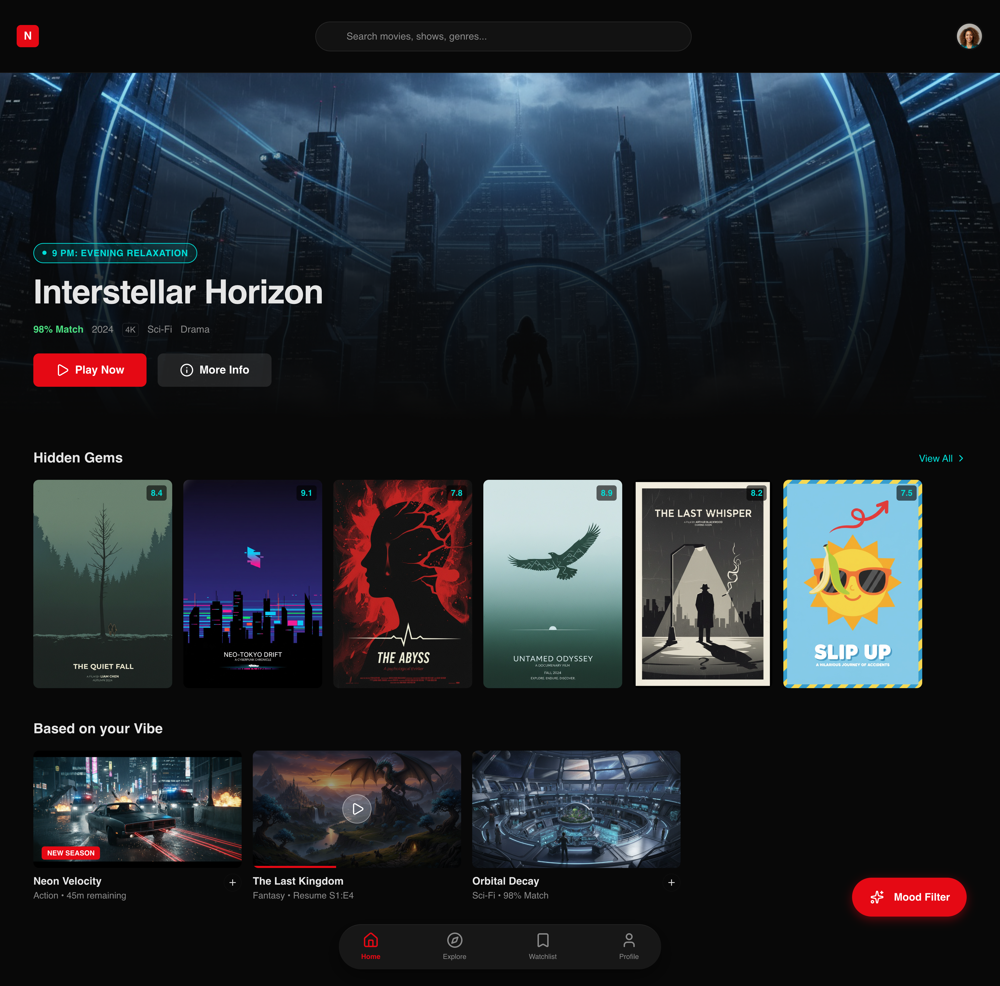

# PRD: Dynamic Movie Discovery & Recommendation Platform

## 📖 Documentation Hub

> To understand the full scope of the Nexus platform, please refer to the following specialized documents:

- [🚀 Product Requirements Document (PRD)](./README.md) – _All About Problem Statement, Goals, and User Pain Points.._(See below)
- [💻 Technical Architecture](./nexus-movie/README.md) – _Deep dive into the Technical details, Folder structure, Tech stack, and Installation.._

### 1. Problem Statement

#### Current Context

The streaming landscape is highly fragmented, with movie metadata and availability siloed across multiple, disconnected platforms. Discovery tools often rely on static, historical data and generic popularity metrics rather than real-time user intent or context.

#### User Pain Points

- **Choice Paralysis:** Users are overwhelmed by the sheer volume of content, leading to "search fatigue" where more time is spent browsing than watching.
- **High-Friction Discovery:** Finding a movie requires toggling between third-party review sites, social media, and various streaming apps to verify quality and availability.
- **Stale Recommendations:** Current algorithms struggle to surface niche interests or "hidden gems," often providing repetitive suggestions that ignore the user’s current mood.

#### Business Impact

- **Decreased Retention:** High bounce rates occur when users fail to find relevant content quickly, leading to platform churn.
- **Low Engagement:** Poor discovery efficiency results in lower content consumption and reduced user lifetime value (LTV).
- **Opportunity Cost:** Failing to capitalize on user intent data prevents the platform from building a competitive, data-driven moat.

## 2. Project Goals & Objectives

### Primary Objectives

- **Streamline Content Discovery:** Reduce the cognitive load on users by providing a frictionless interface that moves them from intent to selection in under 60 seconds.
- **Deliver Context-Aware Recommendations:** Leverage multi-dimensional data (mood, aesthetic, and niche interests) to provide highly relevant suggestions that go beyond generic "trending" lists.
- **Harmonize Cross-Platform Metadata:** Create a "single source of truth" for movie data by aggregating availability, ratings, and technical specs from fragmented external providers.

### Success Metrics (KPIs)

- **Average Time-to-Action:** Decrease the average time from app launch to a user performing a high-intent action (e.g., clicking "Watch Now" or "Add to Watchlist").
- **Recommendation Acceptance Rate:** Achieve a >15% click-through rate (CTR) on AI-generated "Suggested for You" carousels compared to standard search results.
- **Metadata Accuracy Score:** Maintain a 99% match rate between our platform’s "Streaming Availability" status and the actual real-time availability on provider apps.

### Non-Goals (Out of Scope)

- **Native Video Hosting:** We are not building an internal video player or Content Delivery Network (CDN); we will deep-link users to third-party streaming services.

- **Full-Scale Social Networking:** We are not building a social media platform with direct messaging or user-to-user follows; the focus remains strictly on discovery and curation.
- **Ticketing & Transactions:** We are not facilitating direct movie ticket purchases or VOD rentals within our interface for the MVP (Minimum Viable Product).

## 3. Target User Personas

### Persona 1: The Choice-Paralyzed Viewer (Inspired by Sami)

- **Name:** Samuel "Sami"

- **Primary Goal:** To find a high-quality, engaging movie within five minutes of opening the app to maximize limited relaxation time after work.
- **Frustration:** "Search Fatigue"—spending 30 minutes scrolling through infinite carousels on Netflix or Prime Video only to give up and watch nothing.

### Persona 2: The Informed Cinephile (Inspired by Alex)

- **Name:** Alemayehu "Alex"

- **Primary Goal:** To discover deep-cut indie films, foreign cinema, and niche directorial works while accessing centralized, high-fidelity metadata (ratings, awards, and technical specs).
- **Frustration:** Fragmented data—having to cross-reference Letterboxd for reviews, IMDb for technical credits, and JustWatch to find where a film is actually streaming.

### Persona 3: The Mood-Based Explorer (Inspired by Maya)

- **Name:** Maya Ashenafi

- **Primary Goal:** To find content that matches a specific "vibe" or emotional state (e.g., "Neon-soaked 80s thrillers" or "Comforting rainy-day dramas") rather than searching by rigid genres.
- **Frustration:** The limitations of traditional genre tagging; "Action" or "Comedy" labels are too broad and fail to capture the specific atmospheric or emotional nuances she is looking for.

## 4. Key Features (Epics)

### Epic 1: Smart Content Discovery & Search

- **Description:** A multi-modal search interface that supports natural language processing (e.g., "gritty sci-fi from the 90s") and mood-based filtering. This addresses **Sami’s** need for speed and **Maya’s** need for nuance.
- **Priority:** P0 (Critical)

### Epic 2: Dynamic Recommendation Engine

- **Description:** An algorithmic backend that generates real-time suggestions based on user behavior, historical preferences, and current context (mood/time of day). It prioritizes "hidden gems" to solve the "stale content" pain point.
- **Priority:** P0 (Critical)

### Epic 3: Unified Media Intelligence (Detail Pages)

- **Description:** High-fidelity detail pages that aggregate metadata from multiple sources (IMDb, Rotten Tomatoes, etc.). It must include trailers, cast/crew deep-dives, and technical specs to satisfy **Alex’s** cinephile requirements.
- **Priority:** P1 (High)

### Epic 4: Cross-Platform Availability & Deep-Linking

- **Description:** A real-time tracking system that identifies which streaming services currently host a title. Includes "One-Click Watch" deep-links that launch the respective provider’s app (Netflix, Disney+, etc.) directly.
- **Priority:** P0 (Critical)

### Epic 5: Universal Watchlist & Curation Tools

- **Description:** A centralized hub where users can save titles across all platforms. Includes the ability to create "Custom Collections" (e.g., "Rainy Day Noir") which feeds back into the recommendation engine to improve accuracy.
- **Priority:** P1 (High)

### Epic 6: Cross-Platform Experience (PWA)

- **Description:** Development of a high-performance Progressive Web App (PWA) to ensure a seamless, "app-like" experience across mobile and desktop without the friction of multiple app store installations.
- **Priority:** P2 (Medium)

That makes total sense. As a Lead Dev, focusing on the **MVP (Minimum Viable Product)** allows us to identify the "thin slice" of functionality we need to launch and start gathering user data without over-engineering.

Here is the updated backlog. I have replaced "Acceptance Criteria" with **MVP Scope**, which defines exactly what we will build for the first release versus what gets pushed to V2.

---

## 5. Backloge

### Epic 1: Smart Content Discovery & Search

| ID      | User Story                                                                                                                      | MVP Scope                                                                                                                       |
| :------ | :------------------------------------------------------------------------------------------------------------------------------ | :------------------------------------------------------------------------------------------------------------------------------ |
| **1.1** | **As a Mood-Based Explorer**, I want to search using natural language, so that I can find movies that match my specific "vibe." | **MVP: Yes.** Basic keyword mapping for moods (e.g., "dark," "funny") and decades. Advanced NLP/Sentence parsing moved to V2.   |
| **1.2** | **As a Choice-Paralyzed Viewer**, I want to see "Top 3 Picks" based on my current time of day, so that I don't have to scroll.  | **MVP: Yes.** A simple logic-gate: if time is 6 PM–10 PM, show "Evening Relaxation" picks; otherwise, show "High Energy" picks. |

### Epic 2: Dynamic Recommendation Engine

| ID      | User Story                                                                                                     | MVP Scope                                                                                                                 |
| :------ | :------------------------------------------------------------------------------------------------------------- | :------------------------------------------------------------------------------------------------------------------------ |
| **2.1** | **As a Choice-Paralyzed Viewer**, I want the home screen to refresh with new suggestions every time I log in.  | **MVP: Yes.** Simple "randomized" shuffle of the top 20 recommended titles to ensure the UI feels fresh on every session. |
| **2.2** | **As an Informed Cinephile**, I want a "Deep Cuts" recommendation section, so that I can discover indie films. | **MVP: No.** (Phase 2). Launch will focus on general popularity + mood matching before refining the "niche" filter logic. |

### Epic 3: Unified Media Intelligence (Detail Pages)

| ID      | User Story                                                                                           | MVP Scope                                                                                                          |
| :------ | :--------------------------------------------------------------------------------------------------- | :----------------------------------------------------------------------------------------------------------------- |
| **3.1** | **As an Informed Cinephile**, I want to view technical specs like aspect ratio and HDR availability. | **MVP: No.** (Phase 2). MVP detail pages will stick to core metadata: Title, Year, Synopsis, Rating, and Director. |
| **3.2** | **As a Choice-Paralyzed Viewer**, I want to watch a trailer directly on the movie detail page.       | **MVP: Yes.** Embedded YouTube player for the primary trailer. Essential for the "discovery" experience.           |

### Epic 4: Cross-Platform Availability & Deep-Linking

| ID      | User Story                                                                                                           | MVP Scope                                                                                                                |
| :------ | :------------------------------------------------------------------------------------------------------------------- | :----------------------------------------------------------------------------------------------------------------------- |
| **4.1** | **As an Informed Cinephile**, I want to see a list of all providers streaming a movie, so that I don't waste time.   | **MVP: Yes.** Basic list showing the top 3 major providers (e.g., Netflix, Disney+, Max) for the user's specific region. |
| **4.2** | **As a Choice-Paralyzed Viewer**, I want to click a provider icon and have it open that specific movie in their app. | **MVP: Yes.** Hardcoded deep-link URI patterns for the top 5 global streaming apps.                                      |

### Epic 5: Universal Watchlist & Curation Tools

| ID      | User Story                                                                                                       | MVP Scope                                                                                                                    |
| :------ | :--------------------------------------------------------------------------------------------------------------- | :--------------------------------------------------------------------------------------------------------------------------- |
| **5.1** | **As an Informed Cinephile**, I want to create and name custom collections (e.g., "French New Wave Essentials"). | **MVP: No.** (Phase 2). MVP will offer one single "Watchlist" per user. Custom folders/naming are a post-launch enhancement. |
| **5.2** | **As a Mood-Based Explorer**, I want to add a "Mood Tag" to items in my watchlist.                               | **MVP: Yes.** This is our unique differentiator. Users can select from 5 pre-defined mood tags when saving a movie.          |

### Epic 6: Cross-Platform Experience (PWA)

| ID      | User Story                                                                                        | MVP Scope                                                                                                          |
| :------ | :------------------------------------------------------------------------------------------------ | :----------------------------------------------------------------------------------------------------------------- |
| **6.1** | **As a Choice-Paralyzed Viewer**, I want to "Install" the app on my phone home screen.            | **MVP: Yes.** Basic PWA manifest and service worker. Essential for the "utility" feel of the platform.             |
| **6.2** | **As an Informed Cinephile**, I want the interface to be responsive across my tablet and desktop. | **MVP: No.** (Phase 2). MVP will be "Mobile-First" and locked to a single-column layout optimized for smartphones. |

## 6. Refinement

### Epic 2: Dynamic Recommendation Engine (Decomposed)

| ID      | User Story                                                                                                                                                                                         | MVP Scope                                                                                                                                   |
| :------ | :------------------------------------------------------------------------------------------------------------------------------------------------------------------------------------------------- | :------------------------------------------------------------------------------------------------------------------------------------------ |
| **2.1** | **As a Choice-Paralyzed Viewer**, I want my recommendations to be filtered by the time of day (e.g., "Wind Down" vs. "High Energy"), so that the content matches my current physical state.        | **MVP: Yes.** Simple time-based category weighting (e.g., 9 PM+ prioritizes "Relaxing" or "Short" content).                                 |
| **2.2** | **As a Mood-Based Explorer**, I want the engine to suggest "Hidden Gems" (low popularity, high rating), so that I don't just see the same blockbuster hits advertised elsewhere.                   | **MVP: Yes.** A dedicated row that queries for movies with >7.5 rating but <10,000 votes in our metadata provider's database.               |
| **2.3** | **As an Informed Cinephile**, I want the ability to "Dismiss" a recommendation, so that the engine stops suggesting films I’ve already seen or have zero interest in.                              | **MVP: Yes.** A simple "Not Interested" button that adds the Movie ID to a 'Blacklist' array in the user profile.                           |
| **2.4** | **As a Choice-Paralyzed Viewer**, I want my recommendations to update instantly after I add a movie to my watchlist, so that I see similar content while I'm in that specific "searching" mindset. | **MVP: No.** (Phase 2). Instant re-ranking requires a real-time event bus. MVP will recalculate the feed on the next app launch or refresh. |

### Definition of Ready (DoR)

**ID:** 1.1 (Refined)
**Title:** Multi-Genre & Mood Filtering Logic
**Statement:** As a **Mood-Based Explorer**, I want to filter movies by a combination of multiple genres and moods (e.g., "Sci-Fi" + "Gritty") simultaneously, so that I can find content that matches my specific atmospheric needs.

As your **Senior QA Engineer and Agile Lead**, I’ve reviewed the requirements for Story 1.1. To ensure zero ambiguity during development and automated testing, I have translated the Acceptance Criteria into **Gherkin (Given/When/Then)** syntax.

This format allows our automated testing framework (like Cucumber or Cypress) to utilize these scenarios as functional tests.

---

### 1. Acceptance Criteria (Gherkin Format)

#### Scenario 1: Successful Multi-Tag Filtering (The Happy Path)

**Given** the Mood-Based Explorer is on the "Discovery" screen  
**And** the platform has successfully fetched the latest movie metadata  
**When** the user selects the "Sci-Fi" genre tag  
**And** the user selects the "Gritty" mood tag  
**Then** the results grid should only display movies containing both "Sci-Fi" AND "Gritty" attributes  
**And** the "Show Results" button should display the correct integer count of matching movies.

#### Scenario 2: No Results Found (The Zero State)

**Given** the user has active filters that return a limited number of results  
**When** the user adds an additional conflicting tag (e.g., "Feel Good" added to "Tragedy")  
**And** no movies in the database match the combined criteria  
**Then** the system should display the message: "No matches for this specific vibe. Try removing a tag!"  
**And** a "Clear All Filters" button should be visible and functional.

#### Scenario 3: Mobile Filter Drawer Interaction (Mobile UX)

**Given** the user is accessing the platform on a mobile device (viewport width < 768px)  
**When** the user taps the floating "Filter" action button  
**Then** a bottom-sheet drawer should slide up containing all available Genre and Mood categories  
**And** the user should be able to toggle multiple tags using a single-tap interaction  
**And** the background content should be dimmed to maintain focus on the selection.

#### Scenario 4: Real-Time Counter Update (Dynamic Feedback)

**Given** the user is inside the filter menu  
**When** the user toggles any tag (On or Off)  
**Then** the system should send an asynchronous request to the count endpoint  
**And** the "See [X] Movies" button should update its value within 200ms without refreshing the entire page.

---

### 2. Recommended Edge Case Scenarios

To ensure the stability of the MVP, the engineering team must account for these three scenarios during the build phase:

1. **The "Race Condition" Toggle:**

   - **Scenario:** A user rapidly taps/toggles 5-10 tags in under two seconds.
   - **Risk:** Multiple overlapping API requests may return out of order, leading to the "Results Count" displaying data for the wrong combination of tags.
   - **Requirement:** Implement **Request Debouncing** (e.g., wait 300ms after the last tap before calling the API) or **AbortControllers** to cancel previous pending requests.

2. **The "Deep-Link State" Mismatch:**

   - **Scenario:** A user shares a URL that contains specific filter parameters (e.g., `?genre=12&mood=5`), but one of those tags has since been deprecated or renamed in the backend.
   - **Risk:** The frontend might crash trying to map a null ID to a UI element, or the API might return a 400/500 error.
   - **Requirement:** The filtering logic must include a **graceful fallback**—if a tag ID is unrecognized, ignore that specific tag and load the remaining valid filters rather than failing the entire request.

3. **Maximum Metadata Load (The "Kitchen Sink" Query):**
   - **Scenario:** A user selects every single available genre and mood tag simultaneously.
   - **Risk:** The SQL query/Database request becomes too complex or the character limit of the URL query string is exceeded.
   - **Requirement:** Set a **maximum limit for active tags** (e.g., max 10) and ensure the backend uses an efficient `WHERE IN` or `JOIN` strategy to prevent a timeout when processing highly complex intersections.

### 💡 Pro Tips

- **Keep it Outcome-Focused:** In the "Key Features" section, focus on the user value rather than the specific tech stack (e.g., "Real-time preference updates" instead of "WebSocket implementation").
- **Prioritize Ruthlessly:** Use the "Priority" field in the Epics section to distinguish between what is "Must-Have" (P0) for launch and what can wait for V2.
- **Define Success Early:** Don't skip the Metrics. Knowing if we are optimizing for "Time Spent on Page" vs. "Conversion to Watchlist" changes how you build the algorithm.
