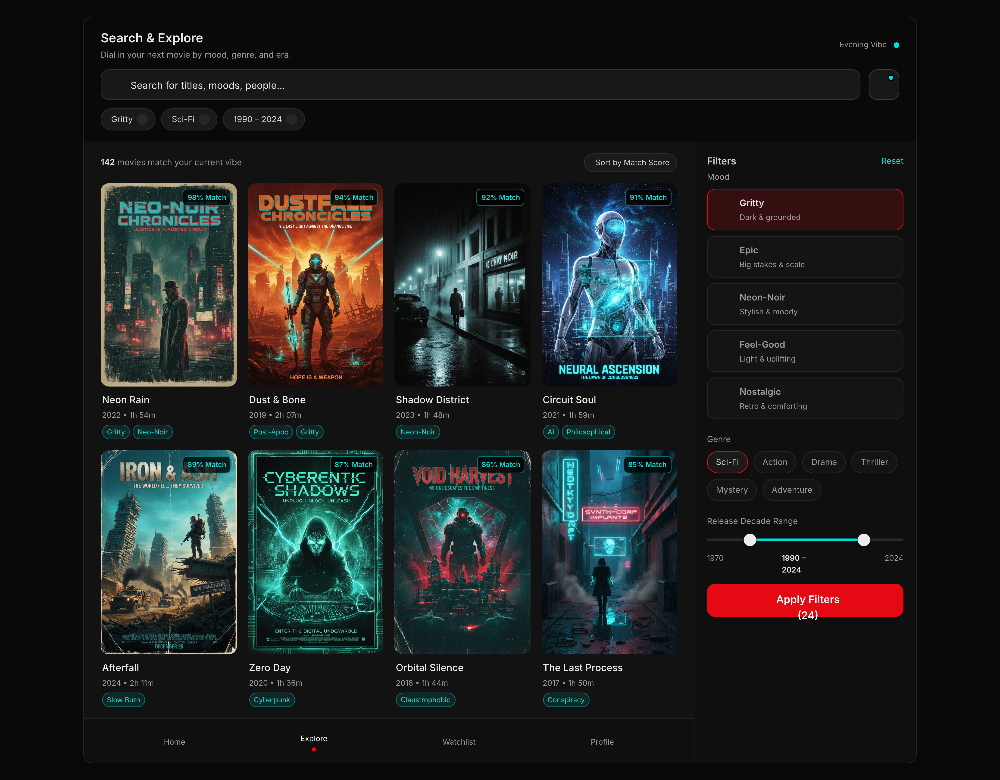
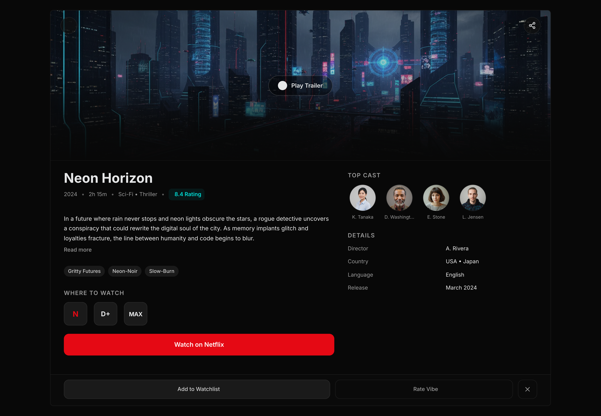
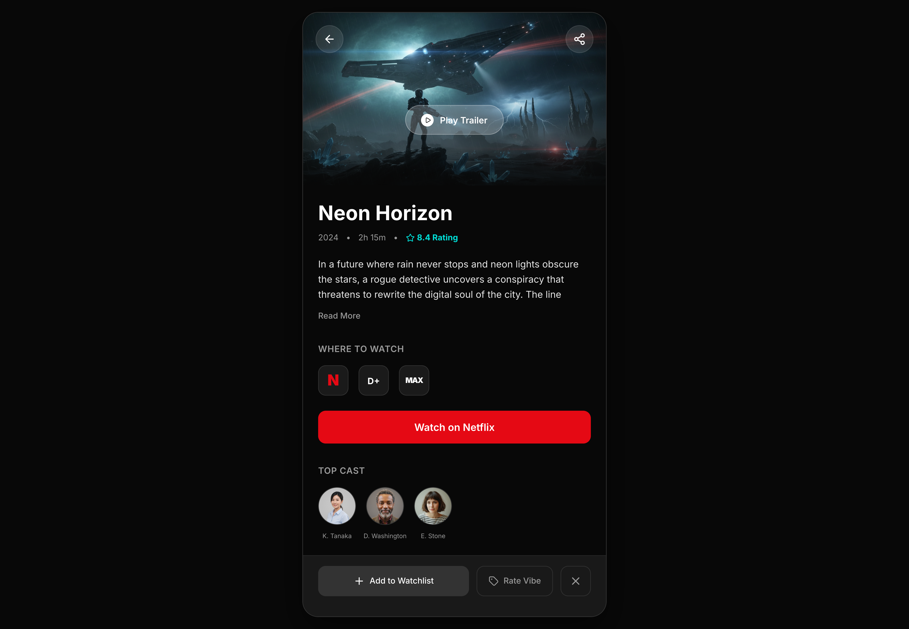
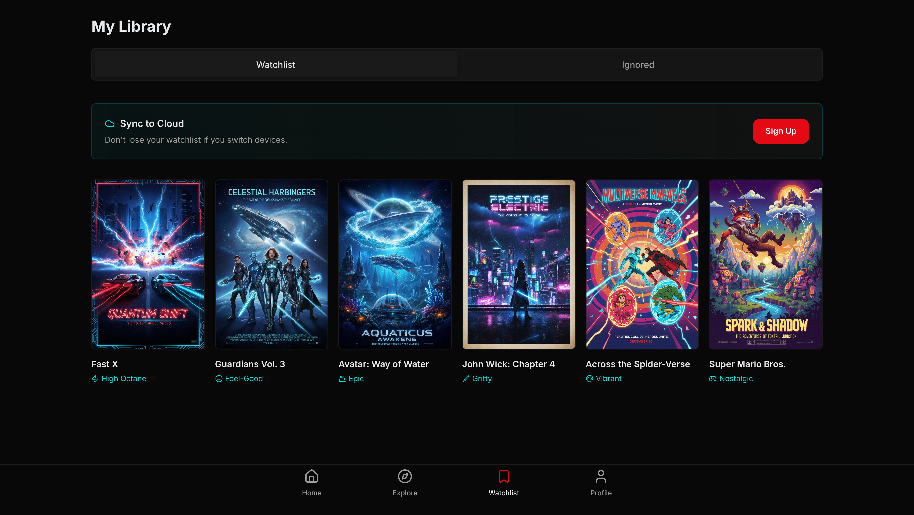
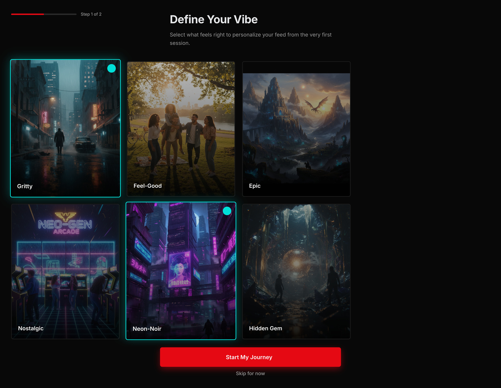
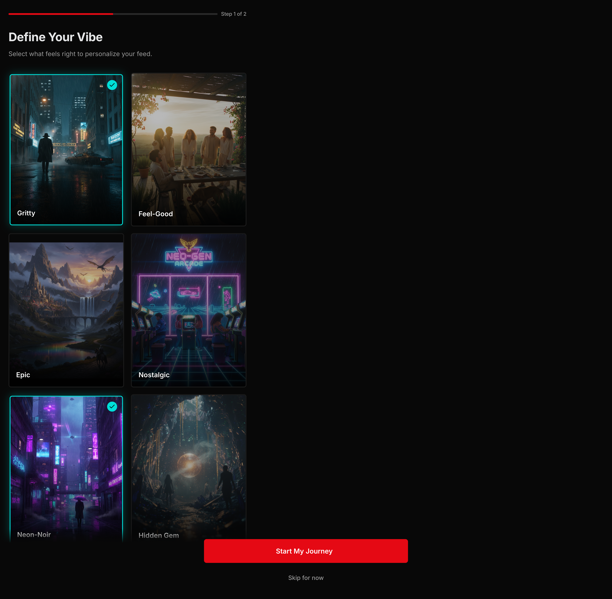
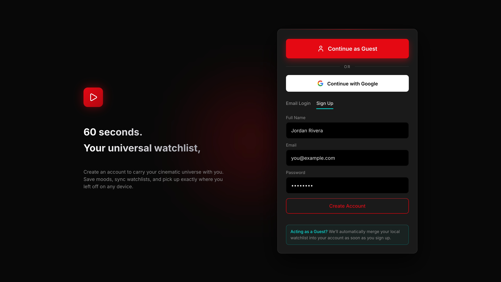
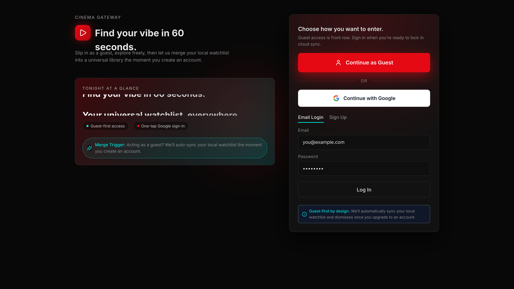

# 🎬 Nexus Movie Discovery Platform

A **guest-first, mood-driven movie discovery PWA** built with modern web architecture principles. Nexus focuses on closing the gap between _finding_ a movie and _watching_ it — in under 60 seconds.

> Designed with scalability, clean architecture, and professional engineering standards from day one.

---

## 🚀 Project Vision

Most movie platforms overwhelm users with endless lists. **Nexus** is different.

Our goal is simple:

- Help users discover _what to watch_ fast
- Personalize results based on **mood, taste, and context**
- Remove friction with **guest-first access** and **deep-link streaming**

Users can explore freely as guests and upgrade seamlessly — without losing data.

---

## 🧠 Core Principles

- **Guest-First UX** – No forced sign-up
- **Mood-Based Discovery** – Movies filtered by vibe, not just genre
- **Clean Architecture** – Memory, Engine, Visuals clearly separated
- **Scalable by Design** – Feature-based modular structure
- **Production-Ready** – SEO, performance, and security in mind

---

## 🖼️ UI & Screens Overview

> The following screens are based on the official UI designs.

### 🏠 Home Dashboard

**Goal:** Move the user from opening the app to watching a movie in under **60 seconds**.

**Features:**

- Hero Carousel (Top Picks)
- Mood-based dynamic rows
- Hidden Gems discovery
- Quick Mood Filter FAB


---

### 🔍 Search & Explore

**Goal:** Advanced discovery using mood, genre, and year filters.



**Features:**

- Active mood filter bar
- Debounced search
- URL-synced filters
- Responsive grid layout

### 🎞 Movie Details

**Goal:** Act as a **single source of truth** for each movie.



**Features:**

- Cinematic header with trailer
- Streaming availability matrix
- Watchlist & Dismiss actions
- Deep-link support for mobile apps

---

### 📚 My Library

**Goal:** Personal movie curation space.


**Features:**

- Watchlist / Dismissed switcher
- Recently-added sorting
- Guest upgrade prompt for cloud sync

---

### 🎭 Onboarding – Vibe Picker

**Goal:** Prime the recommendation engine.


**Features:**

- Mood selection (Gritty, Epic, Feel-Good, etc.)
- Preferred streaming services
- Cold-start injection logic

---

### 👤 Profile & Settings

**Goal:** User control and transparency.



**Features:**

- Identity management
- Region selection (streaming accuracy)
- Data & privacy controls

---

### 🔐 Authentication (Screen 7)

**Goal:** Seamless conversion from guest to member.



**Features:**

- Google authentication
- Continue as Guest option
- Automatic data merge on signup

---

## 🏗️ Technical Architecture

### High-Level Stack

| Layer      | Technology                     |
| ---------- | ------------------------------ |
| Framework  | Next.js (App Router)           |
| Language   | TypeScript                     |
| Styling    | Tailwind CSS                   |
| Animations | Framer Motion                  |
| State      | React Context + TanStack Query |
| Backend    | Supabase                       |
| APIs       | TMDB, JustWatch                |

---

### Architectural Modules

#### 🧠 Memory Module

- AuthContext (Guest vs Member)
- PreferencesContext (Mood, filters)
- LocalStorage → Cloud merge logic

#### ⚙️ Engine Module

- Movie discovery hooks
- Mood-based filtering logic
- Hidden Gems algorithm

#### 🎨 Visuals Module

- Dumb, reusable UI components
- Design system consistency
- Responsive & animated

---

## 📁 Project Structure

```text
src/
├─ app/                # Routing & layouts (Navigator)
├─ components/ui/      # Design system (stateless UI)
├─ features/           # Independent business modules
│  ├─ auth/
│  ├─ library/
│  ├─ movie-discovery/
│  └─ onboarding/
├─ contexts/           # Global state orchestration
├─ lib/                # External service configs
├─ styles/             # Global styles & tokens
├─ types/              # TypeScript contracts
└─ utils/              # Pure helper functions
```

---

## 🔐 Security & Best Practices

- Server Actions for all database writes
- Environment variable isolation
- No sensitive logic in client components
- Strict modular boundaries

---

## ⚙️ Getting Started

### Prerequisites

Make sure you have the following installed:

- Node.js (v18 or higher)
- npm or yarn
- Git

---

### 📦 Installation

Clone the repository and install dependencies:

```bash
git clone https://github.com/your-username/nexus-movie.git
cd nexus-movie
npm install
```

### 🔑 Environment Variables

Create a .env.local file in the project root:

```bash
NEXT_PUBLIC_SUPABASE_URL=your_supabase_url
NEXT_PUBLIC_SUPABASE_ANON_KEY=your_supabase_anon_key
TMDB_API_KEY=your_tmdb_api_key
```

### 🧪 Run in Development

```bash
npm run dev
```

### The app will be available at:

```bash
http://localhost:3000
```

### 🏗️ Build for Production

```bash
npm run build
npm run start
```

## 👨‍💻 Author

**Solomon Tsehay**
University Student – Web & Cloud Development
Project: _Nexus – Movie Discovery Platform_

---

## 📄 License

This project is for educational and portfolio purposes.
